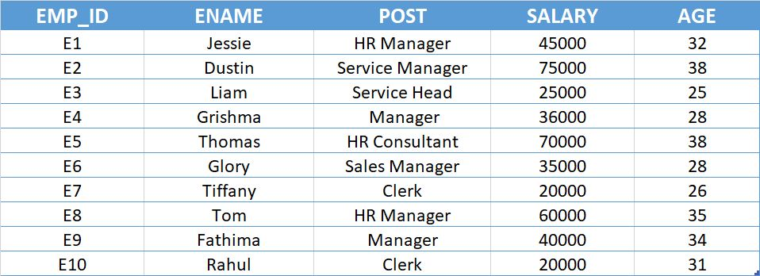
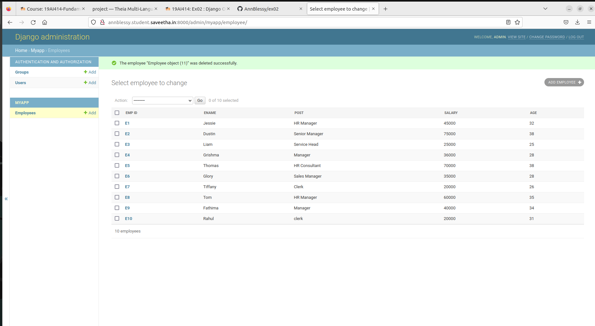
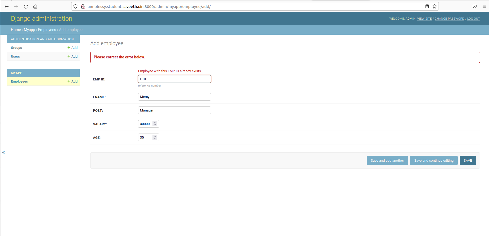

# Django ORM Web Application

## AIM
To develop a Django application to store and retrieve data from a database using Object Relational Mapping(ORM).

## Entity Relationship Diagram




## DESIGN STEPS

### STEP 1:
Clone the orm repository and launch django admin.

### STEP 2:
Startapp and migrate myapp and create employee database with help oh models.py and admin.py

### STEP 3:
Then runserver and enter atleast 10 employee records into the datbase

## PROGRAM
```
## Models code

from django.db import models

from django.contrib import admin

# Create your models here. 

class Employee (models.Model):
    
    EMP_ID=models.CharField(max_length=20,help_text="reference number")
    ENAME=models.CharField(max_length=100)
    POST=models.CharField(max_length=100)
    SALARY=models.IntegerField()
    AGE=models.IntegerField(null=32)

class EmployeeAdmin(admin.ModelAdmin):
    
    list_display=('EMP_ID','ENAME','POST','SALARY','AGE')


### Admin code 

from django.contrib import admin

from .models import Student,StudentAdmin

admin.site.register(Student,StudentAdmin)

```


## OUTPUT

### Admin page


### Primary key confirmation


## RESULT
Database created successfully
